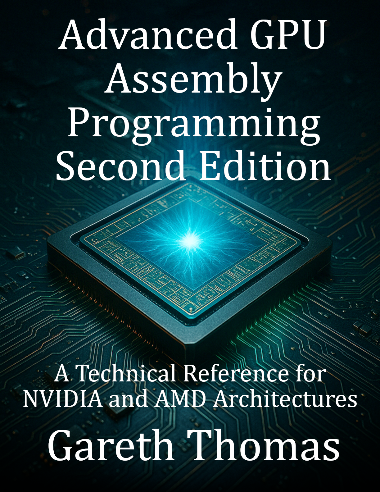

# Advanced GPU Assembly Programming

A Technical Reference for NVIDIA and AMD Architectures

### Cover

### Repository Structure

- `covers/`: Book cover images
- `blurbs/`: Promotional blurbs
- `infographics/`: Marketing visuals
- `source_code/`: Code samples
- `manuscript/`: Drafts and format.txt for TOC
- `marketing/`: Ads and press releases
- `additional_resources/`: Extras

View the live site at [burstbookspublishing.github.io/advanced-gpu-assembly-programming/](https://burstbookspublishing.github.io/advanced-gpu-assembly-programming/)

---

## Chapter 1. Introduction to NVIDIA GPUs

**Section 1. History of NVIDIA GPUs**

  - - Early developments

  - - Key milestones in GPU evolution

**Section 2. Applications of NVIDIA GPUs**

  - - Gaming

  - - Artificial intelligence and machine learning

  - - Scientific computing

## Chapter 2. Understanding GPU Architecture

**Section 1. GPU vs. CPU: Architectural Comparison**

  - - Parallelism in GPUs

  - - Efficiency differences

**Section 2. Basics of Instruction Set Architecture (ISA)**

  - - Definition and components

  - - NVIDIA-specific ISA concepts

## Chapter 3. Key NVIDIA GPU Architectures

**Section 1. Overview of Major NVIDIA Architectures**

  - - Fermi

  - - Kepler

  - - Maxwell

  - - Pascal

  - - Turing

  - - Ampere

  - - Ada Lovelace (latest developments)

**Section 2. Evolution of Design Goals**

  - - Power efficiency

  - - Performance improvements

  - - Architectural innovations

## Chapter 4. Deep Dive into NVIDIA Microarchitectures

**Section 1. Streaming Multiprocessors (SMs)**

  - - Role in parallel computation

  - - Internal design and functionality

**Section 2. Memory Hierarchy**

  - - Global, shared, and local memory

  - - Register allocation and usage

**Section 3. Threading and Warp Scheduling**

  - - Warp schedulers

  - - Thread and block hierarchy

## Chapter 5. CUDA and Its Role in NVIDIA GPUs

**Section 1. Introduction to CUDA**

  - - Parallel computing model

  - - Programming for GPUs

**Section 2. How CUDA Integrates with Hardware**

  - - Kernel execution

  - - Thread and block mapping to hardware

**Section 3. Advantages and Limitations of CUDA**

## Chapter 6. Performance Optimization in NVIDIA GPUs

**Section 1. Profiling and Debugging Tools**

  - - NVIDIA Nsight

  - - CUDA Profiler

**Section 2. Common Bottlenecks and Solutions**

  - - Memory latency

  - - Instruction throughput

**Section 3. Writing Efficient GPU Code**

  - - Principles of Efficient GPU Programming

  - - Advanced Strategies for Optimizing GPU Code

## Chapter 7. Future Trends in NVIDIA GPUs

**Section 1. AI and Deep Learning Integration**

  - - Emerging capabilities in AI acceleration

**Section 2. New Architectural Directions**

  - - Hopper and Grace (potential new architectures)

## Chapter 8. Introduction to AMD GPUs

**Section 1. History of AMD in Graphics Computing**

  - - ATI Technologies and acquisition by AMD

  - - Key breakthroughs in GPU technology

**Section 2. Applications of AMD GPUs**

  - - Gaming

  - - High-performance computing (HPC)

  - - Machine learning

## Chapter 9. Understanding AMD GPU Architecture

**Section 1. GPU vs. CPU: Architectural Comparison**

  - - Role of GPUs in heterogeneous computing

**Section 2. Basics of AMD's ISA**

  - - GCN (Graphics Core Next) and RDNA architectures

## Chapter 10. Key AMD GPU Architectures

**Section 1. Overview of Major AMD Architectures**

  - - Graphics Core Next (GCN)

  - - Vega

  - - RDNA (Radeon DNA)

  - - RDNA 2 and RDNA 3

**Section 2. Evolution of AMD Design Philosophy**

  - - Focus on gaming performance

  - - Power efficiency and ray tracing

## Chapter 11. Deep Dive into AMD Microarchitectures

**Section 1. Compute Units (CUs) and Shaders**

  - - CU design

  - - Shaders and execution model

**Section 2. Memory Architecture**

  - - High Bandwidth Memory (HBM)

  - - Infinity Cache

**Section 3. Command Processors and Pipelines**

  - - Graphics and compute pipelines

  - - Wavefront execution

## Chapter 12. Programming for AMD GPUs

**Section 1. ROCm (Radeon Open Compute) Ecosystem**

  - - ROCm tools and libraries

  - - Heterogeneous programming support

**Section 2. AMD GPUs with OpenCL**

  - - OpenCL programming model

  - - Cross-platform considerations

## Chapter 13. Performance Optimization in AMD GPUs

**Section 1. Profiling and Debugging Tools**

  - - Radeon GPU Profiler (RGP)

  - - AMD uProf

**Section 2. Identifying Bottlenecks**

  - - Memory constraints

  - - Execution inefficiencies

**Section 3. Writing High-Performance GPU Code**

  - - The Art of High Performance GPU Programming

## Chapter 14. Future Trends in AMD GPUs

**Section 1. RDNA 4 and Beyond**

  - - Architectural innovations on the horizon

**Section 2. AMD in Machine Learning and AI**

  - - Role of MI-series GPUs

## Chapter 15. Comparatison of AMD and NVIDIA Architectures

**Section 1. Introduction**

  - - Overview of AMD and NVIDIA as industry leaders

  - - Importance of understanding similarities and differences

  - - Evolution of design philosophies

**Section 2. Architectural Fundamentals**

  - - Key Similarities

  - - SIMD and SIMT principles

  - - Hierarchical threading models and pipeline designs

  - - Memory hierarchy with global, shared, and cached memory

  - - Key Differences

  - - Execution models: AMD Wavefronts vs. NVIDIA Warps

  - - ISA variations: AMD GCN/RDNA vs. NVIDIA PTX/SASS

  - - Hardware structures: AMD Compute Units vs. NVIDIA Streaming Multiprocessors

**Section 3. Memory System Comparisons**

  - - Shared Principles

  - - Hierarchical memory design and prefetching mechanisms

  - - Coalescing and bandwidth optimization strategies

  - - Implementation Differences

  - - AMD's Infinity Cache vs. NVIDIA's Texture Caches

  - - Local Data Share (LDS) vs. Shared Memory organization

**Section 4. Threading and Execution Models**

  - - Thread Grouping

  - - AMD's Wave32/Wave64 vs. NVIDIA's Warp configuration

  - - Divergence Handling

  - - AMD's wave-level masking vs. NVIDIA's warp-level optimization

  - - Scheduling

  - - Asynchronous compute engines (AMD) vs. warp schedulers (NVIDIA)

**Section 5. Performance Optimization Analogies**

  - - Register Allocation

  - - AMD VGPRs/SGPRs and NVIDIA Register Banks

  - - Memory Access

  - - Coalescing strategies and scatter/gather operations

  - - Pipeline Efficiency

  - - Loop unrolling and instruction scheduling techniques

**Section 6. Development Ecosystems**

  - - ROCm vs. CUDA

  - - Open-source vs. proprietary ecosystems

  - - Cross-platform solutions with OpenCL and HIP

  - - Debugging and Profiling

  - - AMD Radeon GPU Profiler vs. NVIDIA Nsight

**Section 7. Cross-Vendor Programming and Trends**

  - - Writing portable GPU code with Vulkan and SPIR-V

  - - AI and ML trends: AMD MI-Series vs. NVIDIA Tensor Cores

  - - Increasing focus on ray tracing and real-time rendering

**Section 8. Conclusion**

  - - Summary of key similarities and differences

  - - Recommendations for cross-vendor optimization

  - - Leveraging tools and best practices for portability and performance

## Chapter 17. GPU Assembly Fundamentals

**Section 1. GPU ISA Architecture Deep Dive**

  - - Binary encoding and instruction formats

  - - Microarchitectural pipeline stages

  - - Vector and scalar execution units

  - - Hardware thread scheduling mechanisms

  - - Clock domains and synchronization barriers

**Section 2. Memory System Architecture**

  - - Memory controller design and protocols

  - - Cache line states and coherency protocols

  - - Memory fence operations and atomics

  - - Page table structures and TLB organization

  - - Memory compression algorithms

**Section 3. Execution Model Implementation**

  - - Warp/wavefront scheduling algorithms

  - - Instruction issue and dispatch logic

  - - Branch prediction and speculation

  - - Predication and mask operations

  - - Hardware synchronization primitives

## Chapter 18. Assembly Language Specifics

**Section 1. Instruction Set Deep Dive**

  - - Opcode formats and encoding schemes

  - - Immediate value handling

  - - Predicate registers and condition codes

  - - Special function unit instructions

  - - Vector mask operations

**Section 2. Register Architecture**

  - - Register file organization

  - - Register bank conflicts

  - - Register allocation algorithms

  - - Spill/fill optimization techniques

  - - Vector register partitioning

**Section 3. Memory Access Patterns**

  - - Cache line alignment requirements

  - - Stride pattern optimization

  - - Bank conflict avoidance

  - - Scatter/gather operation implementation

  - - Atomic operation mechanics

## Chapter 19. AMD GPU Assembly Architecture

**Section 1. GCN/RDNA ISA Technical Details**

  - - Instruction word encoding formats

  - - Scalar and vector ALU implementations

  - - Local Data Share architecture

  - - Wave32/Wave64 execution models

  - - Hardware scheduler implementation

**Section 2. AMD Memory System**

  - - L0/L1/L2 cache architectures

  - - Memory controller interface specs

  - - Cache coherency protocols

  - - Page table walker implementation

  - - Memory view hierarchy

**Section 3. AMD Performance Optimization**

  - - VGPR/SGPR allocation strategies

  - - Instruction bundling techniques

  - - Cache bypass mechanisms

  - - Memory barrier optimization

  - - Wave item permutation techniques

## Chapter 20. NVIDIA GPU Assembly Architecture

**Section 1. PTX/SASS Technical Implementation**

  - - PTX instruction encoding

  - - SASS optimization patterns

  - - Predication implementation

  - - Branch synchronization mechanics

  - - Warp shuffle operation details

**Section 2. NVIDIA Memory Architecture**

  - - Shared memory bank organization

  - - L1/TEX cache implementation

  - - Global memory coalescing rules

  - - Memory consistency model

  - - Atomic operation implementation

**Section 3. NVIDIA Performance Engineering**

  - - Register dependency chains

  - - Instruction latency hiding

  - - Memory transaction coalescing

  - - Warp scheduling optimization

  - - Tensor core matrix operation details

## Chapter 21. Cross-Vendor Techniques

**Section 1. Comparative Analysis**

  - - Key architectural differences between AMD and NVIDIA GPUs

  - - ISA-level comparisons

  - - Execution model trade-offs

**Section 2. Portable Assembly Code**

  - - OpenCL, Vulkan, and SPIR-V

  - - Adapting AMD optimizations for NVIDIA GPUs (and vice versa)

  - - Strategies for platform-specific gains

**Section 3. Cross-Vendor Debugging and Profiling**

  - - Using RenderDoc and GDB for cross-platform analysis

  - - Bottleneck identification and resolution

  - - Ensuring performance parity across GPUs

## Chapter 22. Low-Level Optimization Strategies

**Section 1. Memory System Optimization**

  - - Cache line state manipulation

  - - TLB optimization techniques

  - - Memory controller queue management

  - - Memory barrier minimization

  - - Atomic operation alternatives

**Section 2. Instruction Scheduling**

  - - Dependency chain analysis

  - - Resource conflict avoidance

  - - Instruction reordering techniques

  - - Loop unrolling strategies

  - - Software pipelining methods

**Section 3. Register Optimization**

  - - Register pressure analysis

  - - Live range splitting

  - - Register coalescing techniques

  - - Spill code optimization

  - - Register renaming strategies

## Chapter 23. Practical Applications

**Section 1. Scientific Computing**

  - - FFT optimization techniques

  - - Stencil computation methods

  - - Sparse matrix optimization

  - - Random number generation

**Section 2. Real-Time Graphics**

  - - Ray tracing at the assembly level

  - - Optimizing Vulkan shaders

  - - Texture sampling techniques

**Section 3. Machine Learning**

  - - Convolution implementation

  - - Batch normalization techniques

  - - Gradient computation optimization

## Chapter 24. Performance Analysis Techniques

**Section 1. Performance Counters**

  - - Hardware counter interpretation

  - - Event sampling methods

  - - Pipeline stall analysis

  - - Cache miss classification

  - - Memory bandwidth analysis

**Section 2. Optimization Methodology**

  - - Static code analysis

  - - Dynamic execution tracing

  - - Bottleneck identification

  - - Resource utilization analysis

  - - Latency/throughput optimization

## Chapter 25. Emerging Trends in GPU Assembly

**Section 1. Next-Generation Architectures**

  - - Upcoming trends in GPU ISA design (RDNA3, Hopper)

  - - Unified memory and ray tracing implications

  - - Specialized hardware accelerators (tensor cores, AI chips)

**Section 2. Future of Low-Level Programming**

  - - AI-driven code generation and profiling

  - - Opportunities for low-level developers

  - - Evolution of tools and techniques

## Chapter 26. Advanced Development Tools

**Section 1. Assembly Development Tools**

  - - Binary analysis techniques

  - - Disassembly methods

  - - Code generation tools

  - - Performance modeling

  - - Debugging techniques

**Section 2. Profiling Implementation**

  - - Sampling methods

  - - Trace collection and visualization

  - - Bottleneck analysis and optimization validation

---
